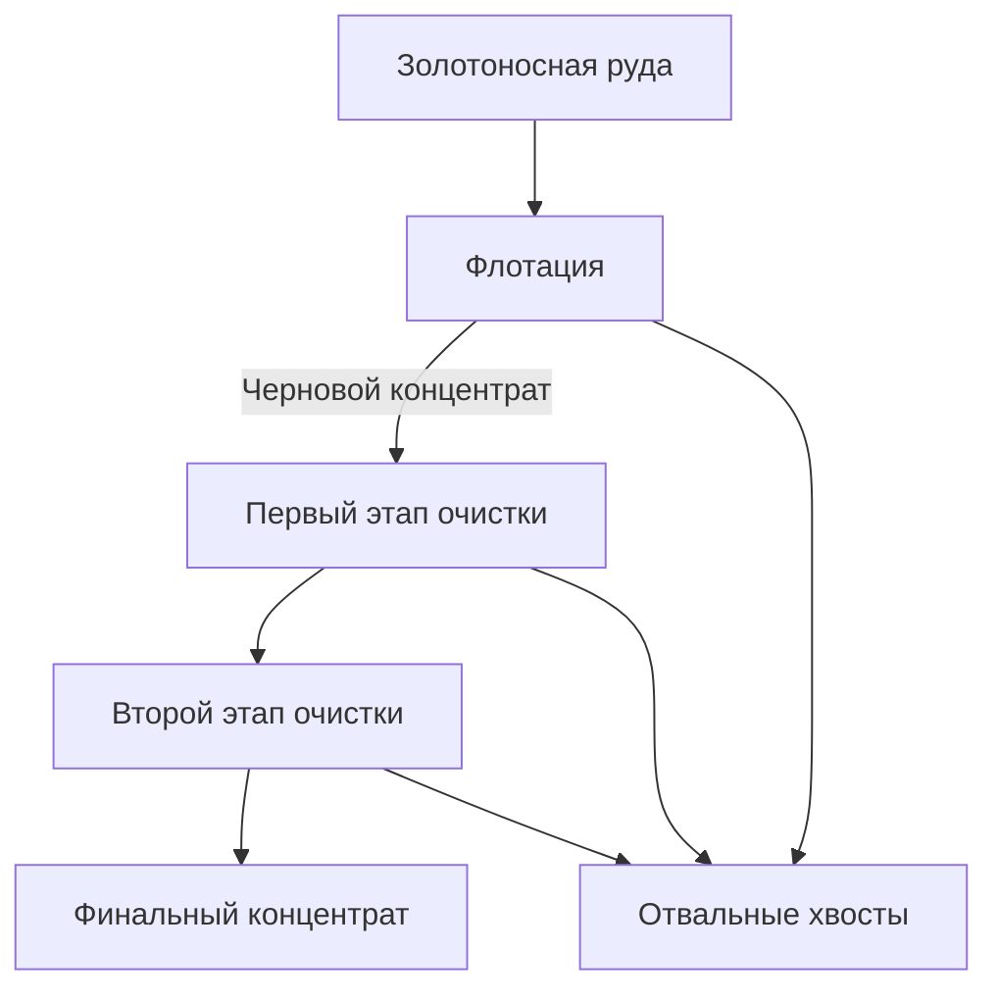

#### Построение модели оптимизации производства, на примере золотодобывающего предприятия

---

Подготовьте прототип модели машинного обучения для «Цифры». Компания разрабатывает решения для эффективной работы промышленных предприятий.

Модель должна предсказать коэффициент восстановления золота из золотосодержащей руды. Используйте данные с параметрами добычи и очистки.

Модель поможет оптимизировать производство, чтобы не запускать предприятие с убыточными характеристиками.

---

**Технологический процесс**

Добытая золотоносная руда послет первичной обработки, превращенная в дроблёную смесь, отправляется на флотацию (обогащение) и двухэтапную очистку.

1. Флотация
Во флотационную установку подаётся смесь золотосодержащей руды. После обогащения получается черновой концентрат и «отвальные хвосты», то есть остатки продукта с низкой концентрацией ценных металлов.
На стабильность этого процесса влияет непостоянное и неоптимальное физико-химическое состояние флотационной пульпы (смеси твёрдых частиц и жидкости).

2. Очистка
Черновой концентрат проходит две очистки. На выходе получается финальный концентрат и новые отвальные хвосты.

---

Изначальные данные находятся в трёх файлах: обучающая и тестовая выборки, исходные данные.
Данные индексируются датой и временем получения информации (признак date). Некоторые параметры недоступны, потому что замеряются и/или рассчитываются значительно позже. Из-за этого в тестовой выборке отсутствуют некоторые признаки, которые могут быть в обучающей. Также в тестовом наборе нет целевых признаков. Исходный датасет содержит обучающую и тестовую выборки со всеми признаками.

Формулы метрик качества:

### $sMAPE = \frac{1}{N} \displaystyle\sum_{i=1}^{N}\frac{|y_i - ŷ_i|}{(|y_i| + |ŷ_i|)/2} \times100 $%

### $Итоговое\ sMAPE = 25$% $\times sMAPE(rougher) + 75$% $\times sMAPE(final)$ 

---

**План работы**

1. Обзор и подготовка данных:
    
    1.1 Обзор данных и изучение общей информации (3 таблицы);
    
    1.2 Проверка правильности расчета эффективности обогащения;
    
    1.3 Анализ признаков, недоступных в тестовой выборке;
    
    1.4 Предобработка данных.

2. Анализ данных:

    2.1  Анализ изменения концентрация металлов (Au, Ag, Pb) на различных этапах очистки;
    
    2.2  Сравнение распределения размеров гранул сырья на обучающей и тестовой выборках;
    
    2.3  Исследование суммарной концентрации всех веществ на разных стадиях: в сырье, в черновом и финальном концентратах.

3.  Построение модели:

    3.1  Написание функции для вычисления итоговой sMAPE;
    
    3.2  Обучение разных моделей и оценка их качества кросс-валидацией. Выбор лучшей модели и проверка её на тестовой выборке.

4. Общий вывод

---

**Используемые библиотеки:**

- pandas
- sklearn
- math
- numpy
- matplotlib
- scipy 
- copy
- seaborn
